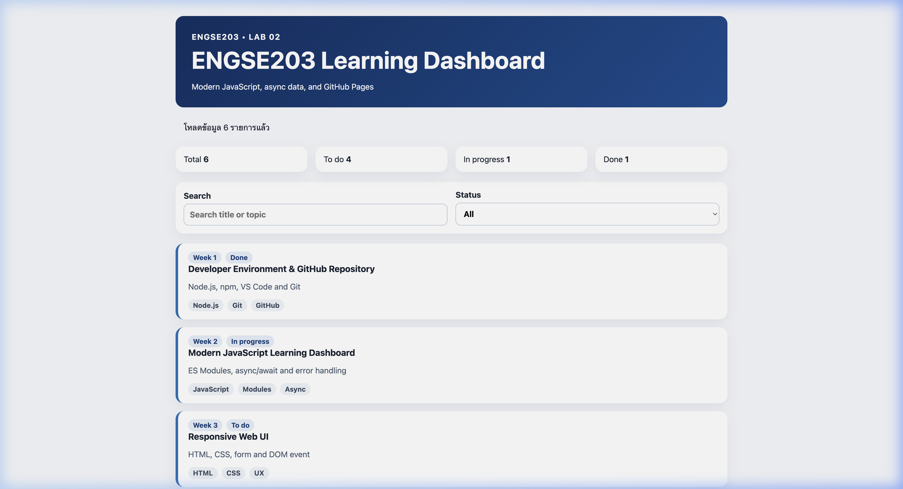
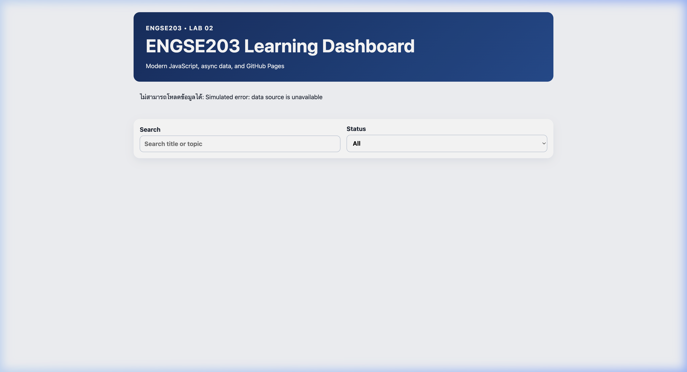

# ENGSE203 LAB 02 Modern JavaScript

**ชื่อ-นามสกุล:** ธนรัก ชุ่มสวัสดิ์ (Thanarak Chumsawat)  
**รหัสนักศึกษา:** 68543210018-6  

---

## คำอธิบาย LAB (Lab Description)

แล็บนี้เป็นการพัฒนาเว็บแอปพลิเคชันด้วย **Modern JavaScript (ES Modules)** โดยระบบจะจำลองหน้าจอ Dashboard แสดงรายการความคืบหน้าการทำงาน (Learning Tasks Dashboard) ซึ่งมีหัวข้อสำหรับการเรียนรู้และเทคโนโลยีที่เกี่ยวข้องดังนี้:
- **Asynchronous Data Fetching**: ใช้ Fetch API ในการอ่านข้อมูลแบบอะซิงโครนัสจากไฟล์ JSON (`learning-tasks.json`) ร่วมกับโครงสร้าง `async/await`
- **State Management & Filtering**: จัดการคัดกรองข้อมูลตามความคืบหน้า (To do, In progress, Done) และกล่องระบุคำค้นหาแบบ Real-time โดยอัปเดตสถานะของแบบสอบถาม
- **DOM Manipulation**: เรนเดอร์ตัวการ์ดสถิติ (Stats Cards) และการ์ดแสดงผลงานความก้าวหน้า (Task Cards) อย่างสวยงามแบบไดนามิกด้วย Vanilla JavaScript
- **Robust Error Handling**: ดักจับและคุ้มกันข้อผิดพลาด (Exception Handling) พร้อมประยุกต์ใช้เพื่อแสดงผลการโหลดเสียหาย และรองรับโหมดส่งการจำลองความล้มเหลวผ่าน URL query parameter (`?simulateError=1`)
- **Static Hosting Pages**: ปรับการตั้งค่าการจัดจำหน่ายของ Vite ให้เซฟผลลัพธ์ลงโฟลเดอร์ `docs` เพื่อนำขึ้นพับลิชบนระบบโฮสติ้งของ GitHub Pages

---

## วิธีการรันโปรแกรม (How to Run)

โปรเจกต์นี้ทำงานร่วมกับ **Vite** และ **Modern JavaScript (ES Modules)** โดยขั้นตอนการติดตั้งและทดสอบระบบมีดังนี้:

### 1. ติดตั้ง Dependencies
ใช้คำสั่งด้านล่างเพื่อติดตั้ง Library ที่เกี่ยวข้องทั้งหมด:
```bash
npm install
```

### 2. รันในโหมดพัฒนา (Development Mode)
ใช้คำสั่งนี้เพื่อสตาร์ต Local Development Server:
```bash
npm run dev
```
หลังจากรันเสร็จแล้ว จะสามารถเข้าถึง Dashboard ผ่าน URL:
[http://localhost:5173/engse203-lab02-68543210018-6/](http://localhost:5173/engse203-lab02-68543210018-6/)

### 3. การสร้าง Build สำหรับ Production
เพื่อทำการ Build เป็น Static files สำหรับ Deploy บน GitHub Pages ให้ใช้คำสั่ง:
```bash
npm run build
```
ไฟล์ที่ผ่านการคอมไพล์จะถูกจัดเก็บไว้ในโฟลเดอร์ `docs/` ซึ่งออกแบบมาให้พร้อมเปิดใช้งานบน GitHub Pages ทันที

---

## รายละเอียดหน้าจอระบบ (Screenshots)

### สภาวะทำงานปกติ (Normal Flow)
หน้าจอภารกิจและแดชบอร์ดสรุปการศึกษาของสัปดาห์ต่างๆ โหลดข้อมูลเสร็จสมบูรณ์ แสดงรายการ Week 1 ถึง Week 6


### สภาวะจำลองข้อผิดพลาด (Error Handling Flow)
เมื่อทำการต่อท้าย URL ด้วย query parameter `?simulateError=1` ตัวอย่างเช่น:
[http://localhost:5173/engse203-lab02-68543210018-6/?simulateError=1](http://localhost:5173/engse203-lab02-68543210018-6/?simulateError=1)  
ระบบจะแสดงป้ายแจ้งเตือนสีแดง แสดงข้อผิดพลาดที่เกิดขึ้นจริงในขณะดึงข้อมูล (API Simulation Error)


---

## References & AI Assistance

### เครื่องมือและแหล่งอ้างอิงที่ใช้งาน (References)
- **Vite.js Documentation**: สำหรับการทำ Build Configuration เพื่อส่งผลลัพธ์ไปยัง `docs/`
- **MDN Web Docs**: สำหรับการอ้างอิงและศึกษาโครงสร้างไวยากรณ์ `fetch()`, `Async/Await`, `Array.prototype.reduce()`, `Array.prototype.filter()` และ JavaScript ES Modules
- **Vanilla CSS (Flexbox & Grid)**: สำหรับจัดเรียงโครงสร้างโครงสรุปสถิติ (Stats Cards) และการควบคุมเลย์เอาต์การนำเสนอ (Task Cards)

### การช่วยเหลือจาก AI (AI Assistance)
- **Gemini**: เรียบเรียงเอกสาร `README.md`
